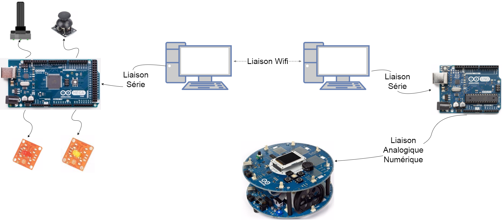

# Remote Controlled Car Arduino

La configuration du projet est la suivante : 

Une vidéo de démonstration du prototype peut être trouvée à cette adresse : 

[https://youtu.be/Y-n1wsfHopE](https://youtu.be/Y-n1wsfHopE)
